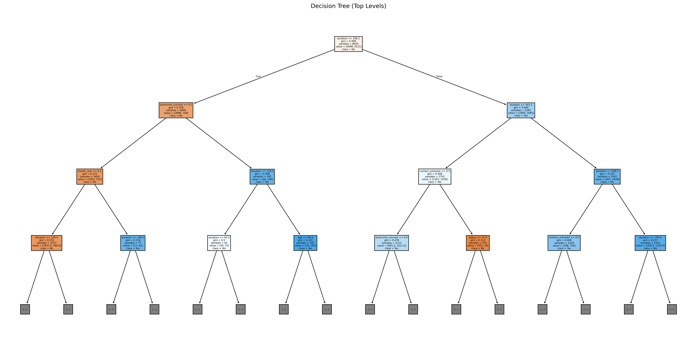

# **Bank Marketing Campaign Analysis**
### 📊 A data-driven approach to understanding customer behavior in banking.

## **Overview**
This project analyzes a bank’s marketing campaign to identify key factors influencing customer subscription to term deposits. Using **Python, Pandas, Matplotlib, and Scikit-Learn**, we process the dataset, visualize trends, and implement a **Decision Tree Classifier** for prediction.

## **Dataset**
- **Source:** [Kaggle - Bank Marketing Dataset](https://www.kaggle.com/datasets/janiobachmann/bank-marketing-dataset).
- This dataset was sourced from Kaggle at the time of use. To ensure consistency with the analysis in this project, please [download the dataset from this specific link](bank.csv) to match the version used.
- The dataset contains **customer demographics, previous interactions, and campaign response data**.
- Features include:
  - Age, Job, Marital Status, Education
  - Contact Type, Duration, Campaign Outcome
  - Previous Loan and Deposit Status

## **Technologies Used**
- **Data Analysis:** Pandas, NumPy
- **Visualization:** Matplotlib, Seaborn
- **Machine Learning:** Scikit-Learn (Decision Tree)
- **Notebook Environment:** Google Colab

## **Decision Tree Classifier**
The project implements a **Decision Tree model** to predict whether a customer will subscribe to a term deposit. The model achieves an **accuracy of ~82%** after hyperparameter tuning.

### **Decision Tree Visualization**
  
_(Ensure you add `decision_tree_output.png` to your repository)_

## **Results & Insights**
- **Feature Importance:** The most influential factors were **contact duration, number of campaigns, and previous marketing outcomes**.
- **Customer Trends:** Older individuals and those with previous deposits had a higher likelihood of subscribing.

## **How to Run the Project**
1. Clone the repository:
   ```bash
   git clone https://github.com/YourRepo/Bank_Marketing_Campaign_Analysis.git

2. Open the Jupyter Notebook or Colab file.

